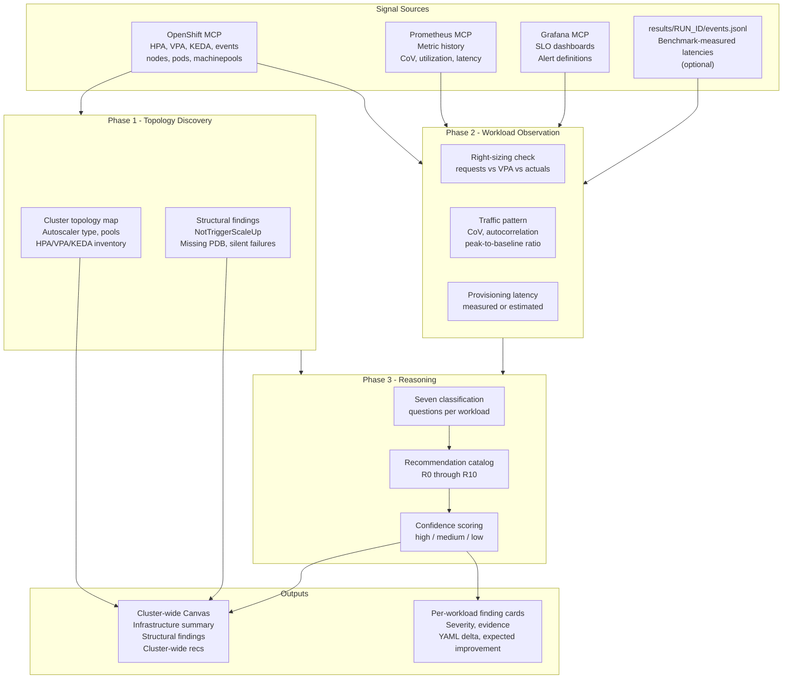
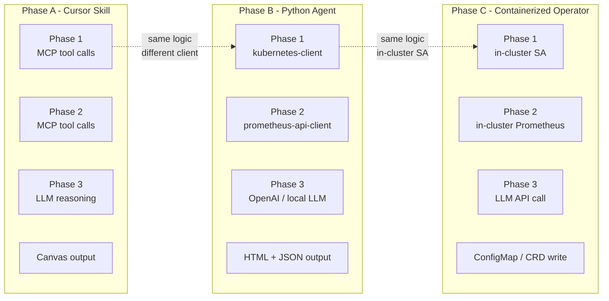

# Autoscaling Advisor — Architecture

## Component Overview

```
┌─────────────────────────────────────────────────────────────────┐
│  Cursor Skill (Phase A prototype)                               │
│                                                                 │
│  ┌──────────────┐   ┌──────────────────┐   ┌────────────────┐  │
│  │  Phase 1     │   │  Phase 2         │   │  Phase 3       │  │
│  │  Topology    │──▶│  Workload        │──▶│  Reasoning &   │  │
│  │  Discovery   │   │  Observation     │   │  Recommendations│ │
│  └──────┬───────┘   └──────┬───────────┘   └───────┬────────┘  │
│         │                  │                        │           │
│    MCP: oc/k8s        MCP: Prometheus          Canvas output   │
│    MCP: oc/k8s        MCP: Grafana                             │
└─────────────────────────────────────────────────────────────────┘
         │                  │                        │
         ▼                  ▼                        ▼
  Cluster state        Metric history          Recommendation
  (live reads)         (7d histograms)         JSON + Canvas
```

---

## Data Flow



---

## Phase 1 — Topology Discovery

### Queries executed (OpenShift MCP)

```
# Node autoscaler detection
oc get clusterautoscaler -o json           → CAS present + config
oc get nodeclaims -A -o json              → Karpenter present (hcp-autonode)
oc get nodepool -A -o json                → Karpenter NodePool topology

# Machine pool topology
oc get machineset -n openshift-machine-api -o json
rosa list machinepools --cluster <name>    → fallback via shell

# Autoscaling object inventory
oc get hpa -A -o json
oc get vpa -A -o yaml
oc get scaledobject -A -o yaml            → KEDA (if operator installed)
oc get scaledjob -A -o yaml              → KEDA batch
oc get pdb -A -o json

# Event scan (last 1h)
oc get events -A --field-selector reason=FailedScheduling -o json
oc get events -A --field-selector reason=NotTriggerScaleUp -o json
oc get events -A --field-selector reason=TriggeredScaleUp -o json
oc get events -A --field-selector reason=OOMKilling -o json
```

### Structural findings produced

| Finding ID | Condition | Severity |
|------------|-----------|----------|
| `F-NOTRIGGER` | `NotTriggerScaleUp` events in last 24h | critical |
| `F-PENDING` | Pods in `Pending` state > 5 minutes | critical |
| `F-NO-AUTOSCALE` | Deployments with no HPA/VPA/KEDA and variable replica history | warning |
| `F-NO-PDB` | StatefulSets or Deployments with `maxReplicas > 1` and no PDB | warning |
| `F-POOL-MISMATCH` | HPA `maxReplicas` capped below current desired replicas | warning |
| `F-VPA-CONFLICT` | VPA in `Auto` or `Recreate` mode alongside HPA on CPU | critical |
| `F-KEDA-MISSING-AUTH` | KEDA `ScaledObject` referencing a `TriggerAuthentication` that doesn't exist | critical |

### Phase 1 Canvas output

Sections:
- Stat row: node autoscaler type, total nodes, workloads with HPA, with KEDA, with nothing
- Structural findings table (severity-sorted)
- Machine pool / NodePool topology table
- Provision latency estimate (from events.jsonl or node creation history)

---

## Phase 2 — Workload Observation

### Right-sizing check (per workload)

```
For each Deployment/StatefulSet with HPA or KEDA:

1. Read current container requests from the Deployment spec
2. Read VPA recommendation if a VPA object exists for this target:
     vpa.status.recommendation.containerRecommendations[].target
3. If no VPA: query Prometheus for actual p95 CPU/memory over 7d:
     quantile_over_time(0.95, container_cpu_usage_seconds_total{...}[7d])
     quantile_over_time(0.95, container_memory_working_set_bytes{...}[7d])
4. Compute ratio: current_request / p95_actual
```

Thresholds:
- ratio > 2.0: over-provisioned (R0 candidate)
- ratio < 1.1 or OOMKilled count > 0: under-provisioned (R0 critical)

### Traffic pattern analysis (per workload)

```
Prometheus queries (7-day window):

# Replica count history (from HPA or kube_deployment_spec_replicas)
changes(kube_horizontalpodautoscaler_status_current_replicas{...}[7d])

# Request rate if HTTP-instrumented
rate(http_requests_total{namespace="...", deployment="..."}[5m])

# Compute CoV:
  mean = avg_over_time(metric[7d])
  stddev = stddev_over_time(metric[7d])
  CoV = stddev / mean

# 24h autocorrelation proxy:
  Compare avg by hour-of-day over 7d for a pattern
  (Prometheus doesn't natively autocorrelate; agent computes from range query)
```

Pattern classification:
- CoV < 0.2 → steady-state
- CoV 0.2–0.5, no daily pattern → moderate burst
- CoV 0.2–0.5, strong daily pattern → predictable peak
- CoV > 0.5 → high-variance / spike-prone

### Provisioning latency resolution

Priority order:
1. `results/<RUN_ID>/events.jsonl` — milestones from test 03/10/14 for this cluster
2. Node creation event history: `oc get events -n openshift-machine-api | grep Created`
3. Default estimates by cluster type (Classic ~6 min, HCP ~4 min, AutoNode ~2.5 min)

---

## Phase 3 — Reasoning and Recommendation Engine

### Classification → Recommendation mapping

```
Q1 (right-sizing) → R0 if over- or under-provisioned
Q2 (HPA headroom) → R1 if threshold > 70% + latency SLA exists
                  → R2 if maxReplicas too low
Q3 (overflow)     → R3+R4 if FailedScheduling > 0/week
                  → R10 if NotTriggerScaleUp present
Q4 (latency budget) → R5 if CAS cluster + latency SLA < provisioning time
Q5 (pattern)      → R3+R4 if CoV > 0.3
                  → R6 if event-driven trigger detected
                  → R7 if predictable daily pattern
Q6 (interruption) → R8 if stateless + no spot configured
Q7 (multi-arch)   → R9 if amd64+arm64 manifest confirmed
```

### Recommendation data model

```json
{
  "workload": "namespace/deployment-name",
  "finding_type": "over_provisioned_requests | hpa_threshold_high | missing_balloon_pods | ...",
  "severity": "critical | warning | info",
  "evidence": {
    "source": "vpa_recommendation | prometheus_query | kubernetes_event | config_inspection",
    "detail": "Human-readable description of what was observed",
    "metric_value": "optional numeric evidence (e.g. 'requests=2000m, VPA target=250m')"
  },
  "recommendation": "Human-readable description of what to change",
  "expected_improvement": "Quantified where possible (e.g. '4x more pods per node, ~75% fewer CAS triggers')",
  "yaml_delta": "Exact manifest patch that implements the recommendation",
  "confidence": "high | medium | low",
  "confidence_note": "What data is missing if not high",
  "benchmark_reference": "Test number and milestone that backs the expected improvement claim"
}
```

### Balloon pod sizing formula

When R3/R4 are recommended:

```
provision_time_s     = measured or estimated (seconds)
burst_rate           = max_replica_delta_per_event (from HPA history)
pod_cpu_request      = container CPU request (post R0 if applied)
pod_memory_request   = container memory request (post R0 if applied)

balloon_replicas     = ceil(provision_time_s / 60 * burst_rate)
balloon_cpu          = pod_cpu_request * balloon_replicas
balloon_memory       = pod_memory_request * balloon_replicas

# Sizing note: balloon_replicas = target_replicas - 1 maximizes protection
# for a single burst event; use the formula above for sustained scaling
```

---

## MCP Tool Contracts

### OpenShift MCP

| Contract point | Detail |
|----------------|--------|
| Always available | Assumed present; skill fails fast if not reachable |
| Auth | Uses active kubeconfig from `tmp/kubeconfig.<cluster>.yaml` |
| Output format | All reads as `-o json` for deterministic parsing |
| Fallback | Shell tool with `oc` CLI if MCP unavailable |

### Prometheus MCP

| Contract point | Detail |
|----------------|--------|
| Endpoint | `thanos-querier` route in `openshift-monitoring` namespace |
| Auth | Bearer token from `oc serviceaccounts get-token` or existing kubeconfig |
| Availability | Optional; findings are downgraded to `confidence: low` when absent |
| Query timeout | 30s per query; skip and flag if exceeded |
| Fallback | `oc exec -n openshift-monitoring thanos-querier -- curl` for single queries |

### Grafana MCP

| Contract point | Detail |
|----------------|--------|
| Endpoint | Grafana route in `openshift-monitoring` or `otel-demo` namespace |
| Availability | Optional; SLO cross-referencing skipped when absent |
| Usage | Read panel queries and alert thresholds only; never write |
| Fallback | Skip SLO context; note in recommendation confidence |

---

## Evolution Architecture

The same logic runs in three forms. The difference is only the I/O layer.



### Phase B Python agent structure

```
advisor/
  agent.py              # entry point: --kubeconfig, --namespace, --workload, --scope
  phases/
    topology.py         # Phase 1: kubernetes-client queries
    observation.py      # Phase 2: prometheus-api-client queries + CoV computation
    reasoning.py        # Phase 3: classification + recommendation catalog
  output/
    canvas.py           # HTML report generator (mirrors Canvas structure)
    json_report.py      # Machine-readable recommendation JSON
  lib/
    sizing.py           # Balloon pod sizing formula
    patterns.py         # CoV, autocorrelation computation
    events_jsonl.py     # Reader for results/<RUN_ID>/events.jsonl
  requirements.txt      # kubernetes, prometheus-api-client, openai (optional)
```

### Phase C containerized agent

```
advisor/
  Dockerfile
  manifests/
    namespace.yaml              # openshift-autoscaling-advisor
    serviceaccount.yaml
    clusterrole.yaml            # read-only: nodes, pods, hpa, vpa, events, ...
    clusterrolebinding.yaml
    cronjob.yaml                # runs daily at 06:00 UTC
    configmap-output.yaml       # template; agent overwrites with findings
```

Minimum ClusterRole verbs: `get`, `list`, `watch` on:
- `nodes`, `pods`, `namespaces`
- `horizontalpodautoscalers`, `verticalpodautoscalers`
- `machinesets`, `machines` (openshift-machine-api)
- `nodeclaims`, `nodepools` (karpenter.sh)
- `scaledobjects`, `scaledjobs` (keda.sh)
- `poddisruptionbudgets`
- `events`

---

## Relationship to Existing Harness

| Existing artifact | How advisor uses it |
|-------------------|---------------------|
| `results/<RUN_ID>/events.jsonl` | Ground-truth latency numbers for R3/R4/R5 sizing |
| `scripts/record-event.py` | Advisor writes advisory events into the same event log |
| `scripts/checkpoint.py` | Advisor run is checkpointed like a benchmark test |
| `manifests/autoscaling/hpa.yaml` | Template for YAML delta recommendations |
| `manifests/overprovisioning/` | Template for balloon pod recommendations |
| `.cursor/skills/benchmark-vpa-advise/` | VPA query pattern reused verbatim in Phase 2 |
| `simulator/index.html` | Timing constants kept in sync with advisor estimates |
