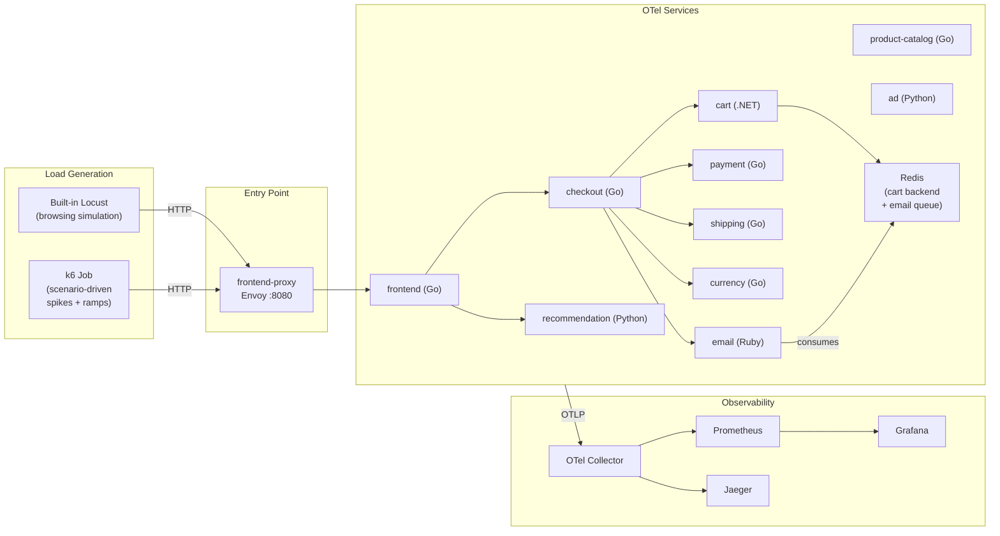
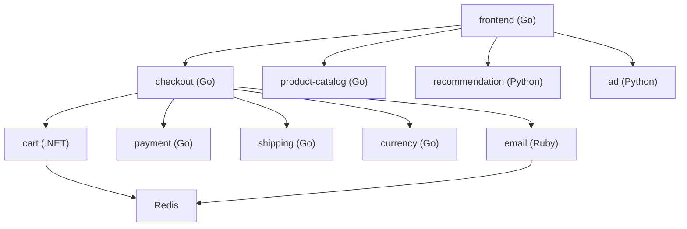
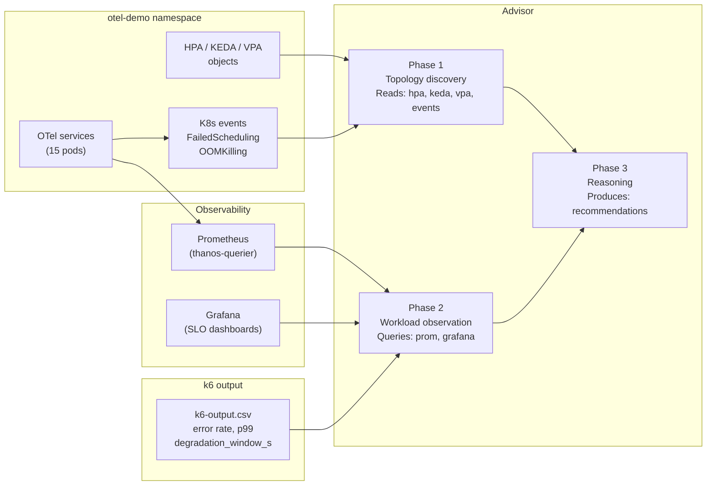

# Load Test Harness — Architecture

## System Overview

```
┌──────────────────────────────────────────────────────────────────────┐
│  ROSA Cluster (otel-demo machine pool: 2× m5.2xlarge)               │
│                                                                      │
│  ┌─────────────────────────────────────────────────────────────┐    │
│  │  Namespace: otel-demo                                        │    │
│  │                                                              │    │
│  │  ┌────────────┐   HTTP    ┌──────────────────────────────┐  │    │
│  │  │  k6 Job    │──────────▶│  frontend-proxy (Envoy)      │  │    │
│  │  │  (load     │           │  :8080                       │  │    │
│  │  │  generator)│           └──────────┬───────────────────┘  │    │
│  │  └────────────┘                      │ routes to services   │    │
│  │                                      ▼                      │    │
│  │  ┌──────────┐ ┌──────────┐ ┌──────────┐ ┌──────────────┐   │    │
│  │  │ frontend │ │ checkout │ │  cart    │ │product-catalog│  │    │
│  │  │  (Go)    │ │  (Go)    │ │ (.NET)   │ │    (Go)      │   │    │
│  │  └──────────┘ └──────────┘ └──────────┘ └──────────────┘   │    │
│  │  ┌──────────┐ ┌──────────┐ ┌──────────┐ ┌──────────────┐   │    │
│  │  │recommend │ │ payment  │ │ shipping │ │   currency   │   │    │
│  │  │ (Python) │ │  (Go)    │ │  (Go)    │ │    (Go)      │   │    │
│  │  └──────────┘ └──────────┘ └──────────┘ └──────────────┘   │    │
│  │  ┌──────────┐ ┌──────────┐                                  │    │
│  │  │   ad     │ │  email   │ ← Redis queue consumer           │    │
│  │  │ (Python) │ │  (Ruby)  │   KEDA ScaledObject              │    │
│  │  └──────────┘ └──────────┘                                  │    │
│  │                                                              │    │
│  │  ┌──────────────────────────────────────────────────────┐   │    │
│  │  │  Observability stack (Helm chart bundled)             │   │    │
│  │  │  Prometheus  │  Grafana  │  Jaeger  │  OTel Collector │   │    │
│  │  └──────────────────────────────────────────────────────┘   │    │
│  └─────────────────────────────────────────────────────────────┘    │
└──────────────────────────────────────────────────────────────────────┘
         │ Prometheus scrape          │ Advisor reads
         ▼                            ▼
  openshift-monitoring          advisor/agent.py
  (thanos-querier)              or Cursor skill
```

---

## Traffic Flow



---

## OTel Demo Service Map

### Services and autoscaling profiles

| Service | Language | Image | Startup | CPU profile | Memory profile | Autoscaling target |
|---------|----------|-------|---------|-------------|---------------|--------------------|
| `frontend` | Go (Next.js SSR) | `otel-demo/frontend` | ~2s | Moderate | ~150MB | HPA on CPU (misconfigured: 80%) |
| `frontend-proxy` | Envoy | `envoyproxy/envoy` | ~1s | Low (proxy) | ~50MB | Not scaled (infra component) |
| `checkout` | Go | `otel-demo/checkoutservice` | ~1s | Low-moderate | ~50MB | HPA on custom metric (RPS/pod) |
| `cart` | .NET | `otel-demo/cartservice` | ~15–20s | Low | ~100MB | HPA on CPU (misconfigured: maxReplicas 2) |
| `product-catalog` | Go | `otel-demo/productcatalogservice` | ~1s | Low-moderate | ~80MB | HPA on CPU (threshold 60%) |
| `recommendation` | Python | `otel-demo/recommendationservice` | ~3s | Low | ~200MB | VPA advise-only |
| `payment` | Go | `otel-demo/paymentservice` | ~1s | Low | ~50MB | None (advisor will flag: no scaler + no PDB) |
| `shipping` | Go | `otel-demo/shippingservice` | ~1s | Low | ~50MB | HPA on CPU (misconfigured: 90%) |
| `currency` | Go | `otel-demo/currencyservice` | ~1s | Low | ~50MB | HPA on CPU (threshold 50%) |
| `ad` | Python | `otel-demo/adservice` | ~3s | Bursty | ~150MB | None (advisor will flag: no scaler) |
| `email` | Ruby | `otel-demo/emailservice` | ~5s | Low | ~100MB | KEDA on Redis queue depth |
| `flagd` | Go | `ghcr.io/open-feature/flagd` | ~1s | Minimal | ~30MB | Not scaled (config service) |
| `otelcol` | Go | `otel/opentelemetry-collector` | ~2s | Moderate | ~200MB | Not scaled (infra) |

The `.NET` cart service (~15–20s startup) is the most interesting for balloon
pod validation — without pre-reserved capacity, a burst that requires new
`cart` replicas will see a long pod-ready delay even if nodes are available.

### Service dependency chain



**Cascade impact:** if `cart` is slow to scale (`.NET` startup + low `maxReplicas`),
checkout calls to cart will timeout, causing `checkout` error rate to rise
even though `checkout` itself is not the bottleneck. This is the cross-service
latency propagation the advisor needs to detect via Jaeger trace data.

---

## k6 Scenario Structure

### Job manifest pattern

```yaml
# load-test/k6/jobs/k6-job-template.yaml
apiVersion: batch/v1
kind: Job
metadata:
  name: k6-<scenario>-<timestamp>
  namespace: otel-demo
spec:
  backoffLimit: 0
  template:
    spec:
      restartPolicy: Never
      serviceAccountName: k6-runner
      containers:
        - name: k6
          image: grafana/k6:latest
          args:
            - run
            - --out
            - csv=/results/k6-output.csv
            - --out
            - json=/results/k6-output.json
            - /scripts/<scenario>.js
          env:
            - name: TARGET_HOST
              value: "frontend-proxy.otel-demo.svc:8080"
            - name: SCENARIO_PARAMS
              valueFrom:
                configMapKeyRef:
                  name: k6-<scenario>-params
                  key: params.json
          volumeMounts:
            - name: scripts
              mountPath: /scripts
              readOnly: true
            - name: results
              mountPath: /results
      volumes:
        - name: scripts
          configMap:
            name: k6-scenarios
        - name: results
          emptyDir: {}
```

Results are retrieved after Job completion:
```bash
POD=$(oc get pods -n otel-demo -l job-name=k6-<scenario> -o jsonpath='{.items[0].metadata.name}')
oc cp otel-demo/${POD}:/results/k6-output.csv load-test/results/k6-<scenario>-<timestamp>.csv
```

### Scenario: `sudden-spike.js`

```javascript
// Simulates an influencer event: immediate 10x traffic jump
// Validates: balloon pods, Karpenter vs CAS response, error rate window

import http from 'k6/http';
import { check } from 'k6';
import { Rate, Trend } from 'k6/metrics';

const errorRate = new Rate('errors');
const degradationWindow = new Trend('degradation_window_ms');

export const options = {
  scenarios: {
    baseline: {
      executor: 'constant-arrival-rate',
      rate: parseInt(__ENV.BASELINE_RPS) || 50,
      timeUnit: '1s',
      duration: '60s',
      preAllocatedVUs: 200,
    },
    spike: {
      executor: 'constant-arrival-rate',
      rate: parseInt(__ENV.SPIKE_RPS) || 500,
      timeUnit: '1s',
      startTime: '60s',
      duration: '300s',
      preAllocatedVUs: 2000,
    },
  },
  thresholds: {
    // SLO thresholds — recorded but do NOT abort the test on breach
    // (we want to measure the full degradation window)
    'http_req_duration{p:99}': ['p(99)<500'],
    'errors': ['rate<0.01'],
  },
};

const BASE_URL = `http://${__ENV.TARGET_HOST}`;

export default function () {
  const res = http.get(`${BASE_URL}/`, {
    tags: { scenario: __ENV.K6_SCENARIO_NAME || 'unknown' },
  });
  errorRate.add(res.status >= 500);
  check(res, { '2xx': (r) => r.status >= 200 && r.status < 300 });
}
```

### Scenario: `ramp.js`

```javascript
// Linear ramp to 5x baseline over 10 minutes
// Validates: HPA threshold calibration (fires at the right point?)

export const options = {
  scenarios: {
    ramp: {
      executor: 'ramping-arrival-rate',
      startRate: parseInt(__ENV.BASELINE_RPS) || 50,
      timeUnit: '1s',
      preAllocatedVUs: 2000,
      stages: [
        { target: parseInt(__ENV.PEAK_RPS) || 250, duration: '10m' },
        { target: parseInt(__ENV.PEAK_RPS) || 250, duration: '5m' },
        { target: parseInt(__ENV.BASELINE_RPS) || 50, duration: '5m' },
      ],
    },
  },
};
```

### Scenario: `daily-pattern.js`

```javascript
// Compressed 24h pattern: morning ramp, midday peak, evening peak
// Validates: proactive pre-warm timing (R7)

export const options = {
  scenarios: {
    daily: {
      executor: 'ramping-arrival-rate',
      startRate: 10,
      timeUnit: '1s',
      preAllocatedVUs: 2000,
      stages: [
        { target: 10,  duration: '3m' },   // overnight quiet
        { target: 150, duration: '5m' },   // morning ramp
        { target: 200, duration: '5m' },   // morning peak
        { target: 100, duration: '3m' },   // midday dip
        { target: 250, duration: '5m' },   // afternoon peak
        { target: 50,  duration: '4m' },   // evening wind-down
      ],
    },
  },
};
```

### Scenario: `burst-and-drop.js`

```javascript
// Sharp 5x spike for 2 minutes then immediate drop back
// Validates: HPA stabilizationWindowSeconds (over-scaling prevention)

export const options = {
  scenarios: {
    burst: {
      executor: 'constant-arrival-rate',
      rate: 250,
      timeUnit: '1s',
      startTime: '30s',
      duration: '2m',
      preAllocatedVUs: 1000,
    },
    baseline_before: {
      executor: 'constant-arrival-rate',
      rate: 50,
      timeUnit: '1s',
      duration: '30s',
      preAllocatedVUs: 200,
    },
    baseline_after: {
      executor: 'constant-arrival-rate',
      rate: 50,
      timeUnit: '1s',
      startTime: '2m30s',
      duration: '5m',
      preAllocatedVUs: 200,
    },
  },
};
```

---

## Prometheus Metric Paths

Metrics the advisor queries per OTel demo service. All metrics are scraped by
the bundled Prometheus instance and exposed via OpenShift's `thanos-querier`.

### Standard Kubernetes metrics (all services)

```promql
# CPU utilization (for HPA threshold validation)
rate(container_cpu_usage_seconds_total{namespace="otel-demo", container="<svc>"}[5m])

# Memory usage (for VPA rightsizing)
container_memory_working_set_bytes{namespace="otel-demo", container="<svc>"}

# Pod restarts (OOMKill detection)
kube_pod_container_status_restarts_total{namespace="otel-demo", container="<svc>"}

# HPA current vs desired replicas
kube_horizontalpodautoscaler_status_current_replicas{namespace="otel-demo", horizontalpodautoscaler="<svc>-hpa"}
kube_horizontalpodautoscaler_status_desired_replicas{namespace="otel-demo", horizontalpodautoscaler="<svc>-hpa"}
```

### OTel-instrumented HTTP metrics (services with HTTP servers)

```promql
# Request rate per service
rate(http_server_request_duration_seconds_count{service_name="<svc>"}[1m])

# p99 latency histogram
histogram_quantile(0.99,
  rate(http_server_request_duration_seconds_bucket{service_name="<svc>"}[5m])
)

# Error rate
rate(http_server_request_duration_seconds_count{
  service_name="<svc>",
  http_response_status_code=~"5.."
}[1m])
/
rate(http_server_request_duration_seconds_count{service_name="<svc>"}[1m])
```

### KEDA / Redis metrics (email service)

```promql
# Redis queue depth (what KEDA uses as trigger)
redis_connected_clients           # proxy for queue depth if direct metric not exposed
# OR from KEDA metrics adapter:
keda_scaler_metrics_value{scaledObject="email-scaledobject", metric="redis-queue-depth"}
```

### k6 output metrics (parsed from CSV, recorded via record-event.py)

```
http_reqs               → requests per second
http_req_failed         → error rate (5xx / total)
http_req_duration{p95}  → p95 latency
http_req_duration{p99}  → p99 latency
```

---

## Autoscaling Configuration Matrix (Full Detail)

### HPA manifests

```yaml
# frontend-hpa.yaml — intentionally misconfigured
# Finding: R1 (threshold 80% too high for <200ms p99 SLO) + R3 (no balloon pods)
apiVersion: autoscaling/v2
kind: HorizontalPodAutoscaler
metadata:
  name: frontend-hpa
  namespace: otel-demo
spec:
  scaleTargetRef:
    apiVersion: apps/v1
    kind: Deployment
    name: frontend
  minReplicas: 2
  maxReplicas: 5
  metrics:
    - type: Resource
      resource:
        name: cpu
        target:
          type: Utilization
          averageUtilization: 80   # too high — latency degrades before HPA fires
  behavior:
    scaleUp:
      stabilizationWindowSeconds: 0
    scaleDown:
      stabilizationWindowSeconds: 300
```

```yaml
# cart-hpa.yaml — intentionally misconfigured
# Finding: R2 (maxReplicas: 2 is too low for .NET JIT burst)
apiVersion: autoscaling/v2
kind: HorizontalPodAutoscaler
metadata:
  name: cart-hpa
  namespace: otel-demo
spec:
  scaleTargetRef:
    apiVersion: apps/v1
    kind: Deployment
    name: cart
  minReplicas: 1
  maxReplicas: 2    # too low — cart .NET JIT needs room to burst to 4+
  metrics:
    - type: Resource
      resource:
        name: cpu
        target:
          type: Utilization
          averageUtilization: 70
```

```yaml
# email-keda.yaml — KEDA Redis queue scaler (correctly configured)
apiVersion: keda.sh/v1alpha1
kind: ScaledObject
metadata:
  name: email-scaledobject
  namespace: otel-demo
spec:
  scaleTargetRef:
    name: email
  minReplicaCount: 1
  maxReplicaCount: 10
  triggers:
    - type: redis
      metadata:
        address: redis-cart.otel-demo.svc:6379
        listName: email-jobs
        listLength: "10"
```

---

## OpenShift SCC Compatibility

### Strategy

Use the `restricted-v2` SCC for all OTel demo pods. Override only the specific
containers that the upstream image ships as root.

```yaml
# load-test/helm/values-rosa.yaml (key sections)
# Applied via: helm upgrade --install otel-demo open-telemetry/opentelemetry-demo \
#   -n otel-demo -f load-test/helm/values-rosa.yaml

# OTel Collector needs a separate SA with anyuid SCC for host-level telemetry
opentelemetry-collector:
  serviceAccount:
    create: true
    name: otelcol-sa
  securityContext:
    runAsNonRoot: false     # Collector image runs as root; binds to anyuid SCC SA

# All application services get restricted-v2 compatible settings
components:
  frontend:
    securityContext:
      runAsNonRoot: true
      allowPrivilegeEscalation: false
      capabilities:
        drop: [ALL]
      seccompProfile:
        type: RuntimeDefault
  # Same block repeated for: checkout, cart, product-catalog, recommendation,
  # payment, shipping, currency, ad, email, flagd

# Grafana and Prometheus (bundled as subcharts) need relaxed SCCs
grafana:
  securityContext:
    runAsUser: 472          # Grafana's expected UID; bind SA to nonroot SCC
prometheus:
  server:
    securityContext:
      runAsUser: 65534      # nobody; compatible with restricted-v2
```

### Namespace annotation

```yaml
# load-test/manifests/namespace.yaml
apiVersion: v1
kind: Namespace
metadata:
  name: otel-demo
  annotations:
    openshift.io/sa.scc.mcs: "s0:c27,c7"
    openshift.io/sa.scc.supplemental-groups: "1000/10000"
    openshift.io/sa.scc.uid-range: "1000/10000"
  labels:
    workload: otel-demo
```

---

## Data Flow to Advisor



The advisor's Phase 2 Prometheus queries target the `otel-demo` namespace
explicitly. The `thanos-querier` route in `openshift-monitoring` federates
metrics from the OTel demo's bundled Prometheus via the
`openshift-user-workload-monitoring` feature (enabled in the cluster).

---

## Machine Pool Isolation

The OTel demo runs on a dedicated machine pool to prevent benchmark workloads
from interfering with load test metrics:

```
Pool: otel-demo          (m5.2xlarge × 2)  → nodeSelector: workload=otel-demo
Pool: bench-standard     (m5.xlarge × N)   → nodeSelector: pool-type=standard
Pool: worker (default)   (m5.xlarge × 2)   → control-plane overflow only
```

k6 load generator Jobs also run in the `otel-demo` namespace on the
`otel-demo` pool — they are lightweight enough not to interfere with the
services they are testing.

---

## Evaluation Loop Integration

The evaluation loop (`PLAN.md` Phase 3) uses this sequence of reads to measure
before/after improvement:

```python
# Before advisor recommendations
baseline = {
    "error_rate_pct":      parse_k6_csv("sudden-spike-baseline.csv"),
    "p99_ms":              parse_k6_csv("sudden-spike-baseline.csv"),
    "degradation_window_s": compute_degradation_window("sudden-spike-baseline.csv"),
}

# After applying advisor YAML deltas
post_rec = {
    "error_rate_pct":      parse_k6_csv("sudden-spike-post-rec.csv"),
    "p99_ms":              parse_k6_csv("sudden-spike-post-rec.csv"),
    "degradation_window_s": compute_degradation_window("sudden-spike-post-rec.csv"),
}

improvement = {
    "error_rate_delta_pct":      baseline["error_rate_pct"] - post_rec["error_rate_pct"],
    "p99_improvement_ms":        baseline["p99_ms"] - post_rec["p99_ms"],
    "degradation_window_delta_s": baseline["degradation_window_s"] - post_rec["degradation_window_s"],
}

# Written into result.extra for Canvas display
result.extra["eval.baseline_error_rate"]     = baseline["error_rate_pct"]
result.extra["eval.post_rec_error_rate"]     = post_rec["error_rate_pct"]
result.extra["eval.error_rate_improvement"]  = improvement["error_rate_delta_pct"]
```

These values feed directly into the advisor's per-workload finding card
`expected_improvement` field, replacing probabilistic estimates with measured
evidence.
