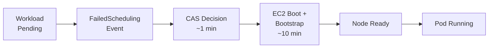
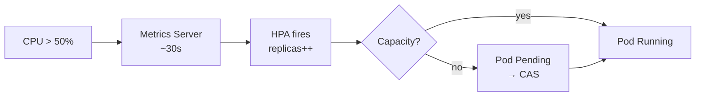
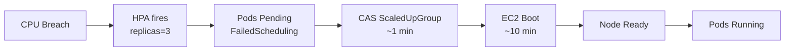
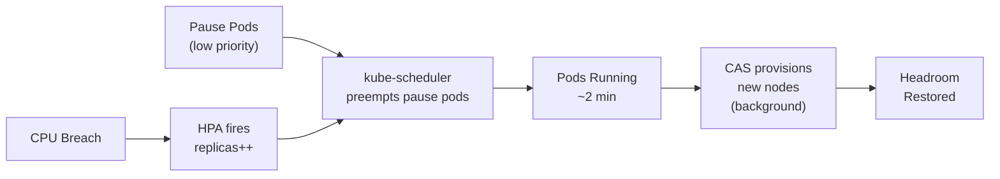

<!-- ============================================================
  SLIDE 1 — Title slide
============================================================ -->

# ROSA Classic Autoscaling: Speed, Scale & the Hidden Bottleneck

## 9 benchmark tests. Real timings. One surprising result.

Paul Czarkowski · Senior Principal Cloud Specialist · Red Hat · May 2026

<!--
Speaker note: Welcome. This talk covers a full autoscaling benchmark run on a ROSA Classic cluster — 9 tests from install timing through overprovisioning. The "hidden bottleneck" is EC2 boot time, and the surprising result is a 4× speedup when you work around it.
-->

---

<!-- ============================================================
  SLIDE 2 — Agenda
============================================================ -->

# This Talk

**We timed everything.**

From cluster creation to pod scheduling, every step of the ROSA Classic autoscaling stack — CAS, HPA, VPA, and overprovisioning — measured end-to-end on a real multi-AZ cluster.

You'll leave with concrete numbers to anchor architecture decisions and three patterns you can use immediately.

**What we'll cover:**

1. Cluster setup & install timing
2. Machine pool provisioning
3. Cluster Autoscaler — scale-up & scale-down
4. HPA and VPA response
5. The full HPA → CAS cascade
6. Overprovisioning: eliminating the bottleneck

<!--
Speaker note: This is a pure benchmark talk — no sales, no product announcements, just measurements. The audience should leave knowing what to expect when they trigger each autoscaling path.
-->

---
layout: section
class: section-header
---

<!-- ============================================================
  SLIDE 3 — Section: The Setup
============================================================ -->

# Section 1
## Cluster config, tooling, and how every timing was captured

<!--
Section landmark. The next two slides cover cluster config and how we measured.
-->

---

<!-- ============================================================
  SLIDE 4 — Cluster configuration
============================================================ -->

# Cluster Configuration

<RhTable
  :headers="['Setting', 'Value']"
  :rows="[
    ['Cluster type',     'ROSA Classic (multi-AZ)'],
    ['Region',          'us-east-1 (3 availability zones)'],
    ['Worker instance', 'm5.xlarge — 4 vCPU / 16 GiB RAM'],
    ['Autoscaler range','3 nodes min → 9 nodes max'],
    ['OCP version',     '4.19.x'],
    ['Run ID',          '20260508T025316-classic'],
  ]"
/>

Multi-AZ means CAS must provision in multiples of 3. This affects minimum scale-out granularity and scale-down thresholds.

<!--
Speaker note: Standard ROSA Classic setup, nothing exotic. Multi-AZ is important for the CAS numbers — you'll see why when we hit scale-down cooldown.
-->

---

<!-- ============================================================
  SLIDE 5 — Test methodology
============================================================ -->

# How We Measured

- **Cursor Agent Skills** — each test is a `.cursor/skills/benchmark-*` skill that orchestrates the scenario end-to-end, captures Kubernetes events, and records timestamped milestones
- **`oc` CLI + Kubernetes events** — `FailedScheduling`, `ScaledUpGroup`, node `Ready` transitions, `desiredReplicas` changes captured via `oc get events -w`
- **`scripts/record-event.py`** — writes timestamped checkpoints into a structured run log keyed by `RUN_ID`
- **`scripts/checkpoint.py`** — tracks per-test `in_progress` / `completed` / `failed` status
- **tmux harness** — long-running `make create-classic` runs in a persistent session so Cursor Shell timeouts can't strand the cluster mid-STS

All timings are wall-clock elapsed from the triggering event to the terminal success state. No internal CAS or Kubernetes API timing — only what an application operator would observe.

<!--
Speaker note: The measurement approach matters as much as the numbers. We measure what a user experiences, not what the scheduler thinks it measured. The tmux harness was critical — a 63-minute install can't run in a foreground shell tool.
-->

---
layout: section
class: section-header
---

<!-- ============================================================
  SLIDE 6 — Section: Cluster Install
============================================================ -->

# Section 2
## Test 01 — How long does `make create-classic` take from CLI to all ClusterOperators Available?

<!--
Section landmark. Install timing is the baseline for everything else.
-->

---
layout: center
class: text-center
---

<!-- ============================================================
  SLIDE 7 — Install time stat callout
============================================================ -->

# Classic Cluster Install

63 min 39 s

OCM submission → ClusterOperators Available · multi-AZ · us-east-1

Includes: STS/OIDC role creation · control-plane provisioning · 3 initial worker nodes across 3 AZs · all cluster operators healthy

<!--
Speaker note: 63 minutes. That is the baseline cost of a fresh ROSA Classic cluster. Most of it is control-plane provisioning — unavoidable for Classic. HCP cuts this to 10–15 minutes, but that's a different talk.
-->

---

<!-- ============================================================
  SLIDE 8 — Install timeline
============================================================ -->

# Install Milestones

<RhTimeline
  :milestones="[
    { date: '0 min',    label: 'make create-classic\nsubmitted',  color: '#73BCF7' },
    { date: '~10 min',  label: 'OCM cluster\naccepted',           color: '#73BCF7' },
    { date: '~40 min',  label: 'oc login\nsucceeds',              color: '#F0AB00' },
    { date: '~55 min',  label: 'Worker nodes\nReady (×3)',        color: '#F0AB00' },
    { date: '63m 39s',  label: 'ClusterOperators\nAvailable',     color: '#5BA352' },
  ]"
  :legend="[
    { color: '#73BCF7', label: 'OCM phase' },
    { color: '#F0AB00', label: 'Provisioning' },
    { color: '#5BA352', label: 'Ready' },
  ]"
/>

The ~30-minute gap between OCM acceptance and worker readiness is control-plane bootstrapping — not EC2 scheduling delays. Workers come online quickly once the API is reachable.

<!--
Speaker note: The important observation here is that the control plane bootstrapping phase dominates. Workers actually provision fast once the API server is up. This sets up the later observation that EC2 boot is the CAS bottleneck, not the orchestration layer.
-->

---
layout: section
class: section-header
---

<!-- ============================================================
  SLIDE 9 — Section: Machine Pool Provisioning
============================================================ -->

# Section 3
## Test 02 — How long from `rosa create machinepool` until the first node is Ready?

<!--
Section landmark. How long does it take to add a new pool of a different machine type?
-->

---

<!-- ============================================================
  SLIDE 10 — Machine pool results
============================================================ -->

# Machine Pool Provisioning Times

<RhTable
  :headers="['Pool', 'Instance', 'vCPU', 'RAM', 'Pool → First Node Ready']"
  :rows="[
    ['bench-standard',  'm5.xlarge',  '4',  '16 GiB', '~7 min'],
    ['bench-memory',    'r5.xlarge',  '4',  '32 GiB', '~7 min'],
    ['bench-compute',   'c5.xlarge',  '4',  '8 GiB',  '~7 min'],
    ['bench-metal',     'm5.metal',   '96', '384 GiB', 'SKIPPED'],
  ]"
/>

All three tested instance types provisioned in approximately 7 minutes. The timing is dominated by EC2 instance boot and OpenShift node bootstrap — not by instance type. Bare-metal was skipped in this run.

<!--
Speaker note: Interesting finding: m5.xlarge, r5.xlarge, and c5.xlarge all take about the same time. The bottleneck is the OS boot + OpenShift node agent startup, which is roughly constant regardless of CPU or RAM size. This is the same EC2 boot time we'll see dominating CAS scale-up.
-->

---
layout: section
class: section-header
---

<!-- ============================================================
  SLIDE 11 — Section: Cluster Autoscaler
============================================================ -->

# Section 4
## Tests 03 & 04 — How fast does CAS provision a node when pods can't schedule, and drain it when load drops?

<!--
Section landmark. CAS is the first autoscaling mechanism we benchmark. Tests 03 and 04 measure scale-up and scale-down.
-->

---
layout: two-cols
---

<!-- ============================================================
  SLIDE 12 — CAS scale-up flow
============================================================ -->

# CAS Scale-Up Flow

**What happens when the cluster runs out of room?**

1. Pod cannot be scheduled → `FailedScheduling` event
2. CAS watches events, evaluates node groups
3. CAS decision: `ScaledUpGroup` (within ~1 min)
4. AWS MachineSet scales → EC2 instance requested
5. Node joins cluster, kubelet starts → `Ready`
6. Pending pod scheduled → `Running`

> *CAS decides in 1 minute. EC2 delivers in 10.*

::right::

<!--
Speaker note: The flow looks simple, but the timing distribution is the story. CAS is fast — the problem is what it asks AWS to do. We measured this end-to-end in test 03.
-->

---

<!-- ============================================================
  SLIDE 13 — CAS scale-up and scale-down results
============================================================ -->

# CAS Scale-Up & Scale-Down Results

<RhTwoColumn>
  <template #left>

  ### Scale-Up (Test 03)
  - **Total: 22m 41s** from `FailedScheduling` to new node `Ready`
  - CAS `ScaledUpGroup` decision: ~1 min
  - EC2 boot + node join: ~10 min
  - Additional CAS evaluation + pod scheduling: ~11 min

  > *CAS is fast. EC2 is not.*

  </template>
  <template #right>

  ### Scale-Down (Test 04)
  - **Total: 9m 59s** from workload removal to EC2 terminated
  - Dominated by `scale-down-delay-after-add` cooldown (default: 10 min)
  - Actual drain + terminate: <60 s
  - Scale-down is safe but slow by design

  > *Default cooldown exists to prevent flapping.*

  </template>
</RhTwoColumn>

<!--
Speaker note: Two very different bottlenecks. Scale-up is bottlenecked by EC2 provisioning. Scale-down is throttled by a deliberate safety cooldown. Both are tunable, but the defaults exist for good reasons.
-->

---

<!-- ============================================================
  SLIDE 14 — Debugging note: CAS event name
============================================================ -->

# An Interesting Discovery

- **Expected event:** `TriggeredScaleUp` (documented CAS event)
- **Actual event:** `ScaledUpGroup` (what ROSA Classic 4.19 emits)

Our benchmark script waited 10 minutes for `TriggeredScaleUp` before falling through to watch for new nodes directly. **No impact on result validity — but worth knowing if you're building CAS dashboards or alerts.**

Event name discrepancies are common across CAS versions. Always verify against your cluster version before alerting on specific event reasons.

<!--
Speaker note: This is the kind of thing you only find by running a benchmark. The docs say TriggeredScaleUp. Your cluster emits ScaledUpGroup. If you're building a scale-up latency alert, you need to test it against the real cluster.
-->

---
layout: section
class: section-header
---

<!-- ============================================================
  SLIDE 15 — Section: Unschedulable
============================================================ -->

# Section 5
## Test 05 — What does CAS do when a pod requests more CPU than any node in the cluster can provide?

<!--
Section landmark. What happens when you ask for more than any node can provide?
-->

---

<!-- ============================================================
  SLIDE 16 — Unschedulable
============================================================ -->

# When CAS Refuses to Scale

**Test 05:** Deploy a pod requesting more CPU/memory than any node type in the cluster can provide.

<RhTwoColumn>
  <template #left>

  ### What CAS does
  - Sees `FailedScheduling` event
  - Evaluates all configured node groups
  - Concludes: even the largest available node cannot fit this pod
  - Emits `NotTriggerScaleUp` — **deliberately does nothing**

  </template>
  <template #right>

  ### Why this matters
  - Without `NotTriggerScaleUp`, you'd provision nodes forever and never schedule the pod
  - CAS protects against runaway scale from misconfigured workloads
  - Result is visible in Kubernetes events within 6m 52s

  </template>
</RhTwoColumn>

> *"I can't help you" is a correct and important answer.*

<!--
Speaker note: Test 05 is not a failure — it's demonstrating correct behavior. The important operational lesson: if CAS is not scaling and you don't see TriggeredScaleUp / ScaledUpGroup, look for NotTriggerScaleUp. Your pod may simply be asking for too much.
-->

---
layout: section
class: section-header
---

<!-- ============================================================
  SLIDE 17 — Section: HPA and VPA
============================================================ -->

# Section 6
## Tests 06 & 07 — How long from CPU breach to new pods Running, and what does VPA recommend for right-sizing?

<!--
Section landmark. Application-level autoscaling: horizontal pod scaling and vertical resource recommendations.
-->

---
layout: two-cols
---

<!-- ============================================================
  SLIDE 18 — HPA flow
============================================================ -->

# HPA Response Flow

**When capacity exists, HPA is fast.**

- CPU breach detected by Metrics Server (~30 s scrape)
- HPA controller reads metrics → `desiredReplicas` increases
- kube-scheduler places new pods on existing nodes
- Pods reach `Running` state

**Test 06 result: 5m 16s** from CPU breach to all pods Running

> *The main latency is metric propagation delay — not pod scheduling.*

::right::

<!--
Speaker note: 5 minutes 16 seconds sounds slow, but the majority is the HPA evaluation window — by default HPA won't scale down for 5 minutes after the last scale-up. The scale-up path itself is fast once the decision is made.
-->

---

<!-- ============================================================
  SLIDE 19 — VPA advise
============================================================ -->

# VPA in Advise Mode (Test 07)

**Vertical Pod Autoscaler in `Off` mode** — reads live resource usage, recommends better requests/limits. Does NOT mutate pods.

<RhTwoColumn>
  <template #left>

  ### What VPA observed
  - cpu-burner workload: `yes > /dev/null` (busy loop)
  - Actual CPU: 100% of request (500m → saturating 1 core)
  - VPA recommendation: **increase CPU limit** above 1000m
  - Memory recommendation: reduce from 256Mi (underused)

  </template>
  <template #right>

  ### HPA + VPA coexistence
  - HPA scales **replicas** on CPU utilization
  - VPA scales **resource requests** per pod
  - Running both simultaneously on the same metric causes conflicts
  - Solution: VPA in `Off` mode for recommendations only
  - Use VPA numbers to calibrate HPA target values

  </template>
</RhTwoColumn>

<!--
Speaker note: VPA completed in 39 seconds — it's not doing any heavy lifting, just reading metrics and computing recommendations. The key takeaway is the coexistence pattern: VPA advises, HPA acts.
-->

---
layout: section
class: section-header
---

<!-- ============================================================
  SLIDE 20 — Section: HPA Triggers CAS
============================================================ -->

# Section 7
## Test 08 — How long does a user wait when HPA fires but the cluster is fully saturated?

<!--
Section landmark. The worst-case latency scenario: HPA fires but there is no capacity, forcing CAS to provision before pods can run.
-->

---
layout: two-cols
---

<!-- ============================================================
  SLIDE 21 — HPA → CAS cascade flow
============================================================ -->

# The Full Cascade

**No capacity left. HPA fires. CAS must provision before pods can run.**

This is the scenario most likely to surprise users in production — the first scale event of the day, or after a scale-down cooldown, when the cluster is saturated.

**Test 08 setup:** `capacity-filler` deployment (45 pause pods) saturates 12 nodes across 3 AZs before the HPA trigger.

::right::

<!--
Speaker note: This is the chain you never want to be in at 9am when traffic ramps up. Every step is correct and expected behavior — but they add up to 11 minutes of pod pending time before your users see the scaled-up service.
-->

---
layout: center
class: text-center
---

<!-- ============================================================
  SLIDE 22 — HPA → CAS time stat callout
============================================================ -->

# HPA Fires. No Capacity. How Long?

11 min 3 s

CPU breach → all pods Running · cluster saturated · 4 new m5.xlarge nodes

HPA decision: &lt;1 min · CAS decision: ~1 min · EC2 boot + join: ~10 min

<!--
Speaker note: Eleven minutes. That's how long your users wait for the scaled pods to start handling traffic, if the cluster has no spare capacity when HPA fires. The CAS and HPA components are working perfectly — the bottleneck is AWS.
-->

---
layout: section
class: section-header
---

<!-- ============================================================
  SLIDE 23 — Section: Overprovisioning
============================================================ -->

# Section 8
## Test 09 — Do low-priority pause pods eliminate the EC2 provisioning wait from the HPA hot path?

<!--
Section landmark. The fix. Overprovisioning with low-priority pause pods eliminates the EC2 provisioning wait from the hot path.
-->

---
layout: two-cols
---

<!-- ============================================================
  SLIDE 24 — How overprovisioning works
============================================================ -->

# The Overprovisioning Pattern

**Pre-reserve compute headroom using low-priority pause pods.**

When real workload needs capacity, it preempts the pause pods instantly. CAS then replaces the evicted pause pods on new nodes — in the background, not on the critical path.

::right::

<!--
Speaker note: The key insight is that the EC2 provisioning still happens — it's just no longer on the critical path for your application pods. The pause pods absorb the wait, and your real workload runs immediately via preemption.
-->

---
layout: center
class: text-center
---

<!-- ============================================================
  SLIDE 25 — The big reveal: 4× speedup
============================================================ -->

# With Overprovisioning

4.1×

faster than raw HPA → CAS · 11 min 3 s → 2 min 41 s

Same cluster. Same HPA. Same CAS. Different scheduling priority.

<!--
Speaker note: This is the headline result. Nothing changed except adding three low-priority pause pods and a PriorityClass object. That's the entire intervention. No infrastructure changes, no CAS tuning, no special AWS configuration.
-->

---

<!-- ============================================================
  SLIDE 26 — Before vs after comparison
============================================================ -->

# Test 08 vs Test 09 — Side by Side

<RhTwoColumn>
  <template #left>

  ### Test 08 — Raw HPA → CAS
  - HPA fires on CPU breach
  - Pods go `Pending` — cluster saturated
  - CAS decides to scale (~1 min)
  - EC2 boots, node joins (~10 min)
  - Pods finally Running
  - **Total: 11 min 3 s**

  </template>
  <template #right>

  ### Test 09 — HPA + Overprovisioning
  - Pause pods reserve headroom (22 s to start)
  - HPA fires on CPU breach
  - Pods **immediately preempt** pause pods
  - Pods Running via preemption
  - CAS replaces pause pods in background
  - **Total: 2 min 41 s**

  </template>
</RhTwoColumn>

> *The cost: 3 × m5.xlarge nodes reserved as headroom ≈ $0.57/hr to save 8 min per burst.*

<!--
Speaker note: The trade-off is explicit cost for latency. At us-east-1 m5.xlarge pricing, three headroom nodes cost about 57 cents per hour. If you have predictable HPA events — morning ramp-up, batch job triggers, scheduled load spikes — that's almost certainly worth it.
-->

---

<!-- ============================================================
  SLIDE 27 — Autoscaling maturity spectrum
============================================================ -->

# Where Does Your Cluster Sit?

<RhSpectrum
  :stages="[
    { label: 'Fixed\nCapacity',           icon: '🔒' },
    { label: 'Manual\nScaling',           icon: '🖐️' },
    { label: 'CAS\nOnly',                 icon: '⚙️' },
    { label: 'HPA + CAS\nOn-demand',      icon: '📈' },
    { label: 'Overprovisioned\nHedge',    icon: '🏃', active: true },
  ]"
  left-label="← reactive and slow"
  right-label="proactive and fast →"
/>

Test 09 demonstrates the highlighted tier. The next step beyond this is Karpenter (AutoNode on ROSA HCP) — which we plan to benchmark in a future run.

<!--
Speaker note: Think of this as a progression. Most clusters start with CAS only. Adding HPA moves you to on-demand horizontal scaling. Adding overprovisioning moves you to the proactive tier where burst latency is measured in seconds, not minutes.
-->

---
layout: section
class: section-header
---

<!-- ============================================================
  SLIDE 28 — Section: Findings & Recommendations
============================================================ -->

# Section 9
## What the numbers tell us — and three things to change in your cluster today

<!--
Section landmark. Drawing conclusions from all nine tests.
-->

---

<!-- ============================================================
  SLIDE 29 — All results table
============================================================ -->

# All Nine Tests at a Glance

<RhTable
  :headers="['Test', 'Scenario', 'Time', 'Key Bottleneck']"
  :rows="[
    ['01', 'Cluster install',          '63m 39s',  'Control plane bootstrap'],
    ['02', 'Machine pool (×3 types)',  '~7 min ea','EC2 boot + node OS init'],
    ['03', 'CAS scale-up',             '22m 41s',  'EC2 boot (~10 min of total)'],
    ['04', 'CAS scale-down',           '9m 59s',   'Default 10-min cooldown'],
    ['05', 'Unschedulable workload',   '6m 52s',   'N/A — correct refusal'],
    ['06', 'HPA response',             '5m 16s',   'Metric propagation delay'],
    ['07', 'VPA advise',               '0m 39s',   'N/A — read-only'],
    ['08', 'HPA → CAS cascade',        '11m 3s',   'EC2 boot on hot path'],
    ['09', 'Overprovisioning',         '2m 41s',   'HPA eval window only'],
  ]"
/>

<!--
Speaker note: Look at the bottleneck column. EC2 boot time appears in three different tests. That's the theme of this benchmark: the slowest thing in the ROSA Classic autoscaling stack is not OpenShift, not CAS, not HPA — it's EC2.
-->

---

<!-- ============================================================
  SLIDE 30 — Key findings
============================================================ -->

# Key Findings

- **EC2 boot time (~10 min) is the dominant latency** in every CAS-triggered path — the scheduler, CAS, and OpenShift node agent add at most ~2 min combined
- **CAS decision is fast (~1 min)** — if your pods are still pending after 3 minutes, look at EC2 or node bootstrap, not CAS configuration
- **Scale-down cooldown is the bottleneck for scale-down**, not drain time — the 10-minute default exists to prevent flapping and is almost always correct to leave alone
- **HPA + CAS in series adds up fast** — 5 min HPA eval + 10 min EC2 = 11 min pod pending on a saturated cluster; this is the scenario overprovisioning was designed to fix
- **Overprovisioning delivers a 4.1× speedup** for zero infrastructure changes — only a PriorityClass and pause pod Deployment

<!--
Speaker note: These five findings are the takeaways. Print them. Put them in your team wiki. They will save someone from spending an afternoon tuning CAS parameters that aren't the bottleneck.
-->

---

<!-- ============================================================
  SLIDE 31 — Recommendations
============================================================ -->

# Recommendations

- **For latency-sensitive workloads:** implement overprovisioning — 3 pause pods on m5.xlarge cost $0.57/hr and save 8 min per burst event
- **For CAS scale-down:** only reduce `scale-down-delay-after-add` if your workload is genuinely predictable and diurnal; default 10 min prevents flapping
- **For HPA calibration:** use VPA advise-only mode to set accurate CPU requests — better requests mean HPA fires at the right threshold, not early or late
- **For event-driven alerting:** verify CAS event names against your actual cluster version — `ScaledUpGroup` not `TriggeredScaleUp` in ROSA Classic 4.19
- **For frequent cluster churn (CI/CD, ephemeral):** consider ROSA HCP — 10–15 min install vs 64 min for Classic makes a significant difference in teardown/rebuild loops

Next benchmark: ROSA HCP + Karpenter (AutoNode private preview) — measuring whether node provisioning speed changes when you swap CAS for Karpenter.

<!--
Speaker note: The first recommendation is the most impactful and the easiest to implement. Everything else is refinement. The Karpenter preview comparison will tell us whether we can push below 2 minutes without overprovisioning.
-->

---
layout: center
class: text-center
---

<!-- ============================================================
  SLIDE 32 — Closing CTA
============================================================ -->

# The EC2 boot is not your fault. But the 11-minute wait is.

Three pause pods. One PriorityClass. Four times faster.

[github.com/rh-mobb/rosa-autoscaling-performance-and-recommendations](https://github.com/rh-mobb/rosa-autoscaling-performance-and-recommendations) ·
[Full benchmark report](../20260508T025316-classic-suite-01-through-09.html)

*Run ID: 20260508T025316-classic · ROSA Classic · multi-AZ · us-east-1 · May 2026*

<!--
Speaker note: Leave the audience with something actionable. The overprovisioning pattern is three Kubernetes objects. Anyone in this room can deploy it today. Questions?
-->
