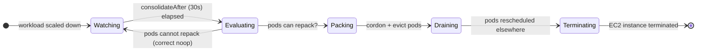

<!-- SLIDE 1 — Title -->

# ROSA HCP AutoNode

## Benchmarking Karpenter in Private Preview — real numbers from a live cluster

Paul Czarkowski · Senior Principal Cloud Specialist · Red Hat · May 2026

<!--
Speaker note: We got access to ROSA HCP AutoNode — the Karpenter integration —
while it's still in private preview. Today I'll share what it took to get it
running, and the performance numbers we measured. Some of these will surprise you.
-->

---

<!-- SLIDE 2 — What is AutoNode -->

# What Is AutoNode?

<RhTwoColumn>
  <template #left>

  ### The old model: Cluster Autoscaler
  - Red Hat manages the controller
  - Scales **MachineSets / MachinePools**
  - Adds whole nodes to a pool
  - Decision cycle: ~1 min after `FailedScheduling`
  - Scale-down: 10 min cooldown (default)
  - No bin-packing — full node per pool type

  </template>
  <template #right>

  ### AutoNode: Karpenter on ROSA HCP
  - Karpenter runs inside the hosted control plane
  - Creates **NodeClaims** — one per workload burst
  - Bin-packs pods across right-sized instances
  - Decision: **sub-second** after pod `Pending`
  - Consolidation: configurable down to `30s`
  - Uses `NodePool` + `EC2NodeClass` CRDs

  </template>
</RhTwoColumn>

> *Same AWS metal, fundamentally different scheduling loop.*

<!--
Speaker note: The key insight: AutoNode doesn't replace EC2 — so launch time
is the same. What Karpenter eliminates is the scheduling decision delay and
the one-size-fits-all node pool model.
-->

---

<!-- SLIDE 3 — Agenda -->

# This Talk

**Private preview. One cluster. Real stopwatch.**

We instrumented every step of the AutoNode lifecycle — from cluster creation through scale-up waves and consolidation rollbacks — and compared the results against our CAS Classic baseline.

**What we'll cover:**

1. Setup — what AutoNode requires beyond standard HCP
2. Cluster install timing
3. Karpenter scale-up benchmark (3 waves)
4. Consolidation benchmark (reverse rollback)
5. Surprising findings + recommendations

<!--
Speaker note: Everything here is from run 20260508T031735-hcp-autonode on
cluster an-bench, us-east-1. The harness is open — scripts are in the repo.
-->

---
layout: section
class: section-header
---

<!-- SLIDE 4 — Section 1 -->

# Section 1
## Setting Up AutoNode

<!--
Speaker note: Before we get to numbers, let's talk about what it actually
takes to enable Karpenter on ROSA HCP. It's not a checkbox — there are
prerequisites that aren't in the standard docs yet.
-->

---

<!-- SLIDE 5 — What AutoNode needs beyond standard HCP -->

# AutoNode Prerequisites

Beyond a standard ROSA HCP cluster, AutoNode requires:

- **IAM policy** — custom policy granting Karpenter EC2 permissions (`ec2:RunInstances`, `ec2:DescribeInstances`, `ec2:CreateTags`, `ec2:TerminateInstances`, and ~15 others)
- **IAM role** — `<prefix>-autonode-operator-role` with OIDC trust for the Karpenter service account
- **CPO inline policy** — `AutoNodeCreateTags` attached to the Control Plane Operator role, allowing EC2 resource tagging at launch time
- **Subnet + SG discovery tags** — private subnets and the default security group must be tagged `karpenter.sh/discovery=<cluster-id>` so Karpenter can find them
- **`rosa edit cluster --autonode=enabled`** — opt-in flag that installs the Karpenter operator into the hosted control plane

None of these are automated by Terraform yet — they run as post-apply steps in the benchmark create script.

<!--
Speaker note: This is the "it's still private preview" reality check. In GA,
most of this will likely be automated via the HCP create flow or Terraform.
For now, each step is a manual CLI call after the cluster is ready.
-->

---
layout: section
class: section-header
---

<!-- SLIDE 8 — Section 2: Install Timing -->

# Section 2
## Cluster Install Timing

<!--
Speaker note: Now let's talk about how long the whole setup actually takes.
-->

---

<!-- SLIDE 9 — Install timeline -->

# Install Milestone Timeline

<RhTimeline
  :milestones="[
    { date: 'T+0',      label: 'Terraform\ninit',            color: '#73BCF7' },
    { date: '+7s',      label: 'terraform apply\nstarted',   color: '#73BCF7' },
    { date: '~+13m',    label: 'Cluster OCM\nReady*',        color: '#5BA352' },
    { date: '+36m',     label: 'OCM 403\nrecovery done',     color: '#F0AB00' },
    { date: '+50m 43s', label: 'AutoNode\nenabled',          color: '#EE0000' },
    { date: '+51m 22s', label: 'oc login\nOK · nodes 2/2',   color: '#5BA352' },
    { date: '+51m 32s', label: 'CRDs Ready\n21/21 COs',      color: '#5BA352' },
  ]"
  :legend="[
    { color: '#73BCF7', label: 'Terraform' },
    { color: '#5BA352', label: 'Cluster ready' },
    { color: '#F0AB00', label: '403 recovery' },
    { color: '#EE0000', label: 'AutoNode setup' },
  ]"
/>

* OCM ready estimated from first 403 error timestamp. ~36 min of the total elapsed time was the manual 403 recovery gap — not representative of a clean run. AutoNode IAM setup itself takes ~30s once the cluster is ready.

<!--
Speaker note: The 403 gap inflates the headline number. In a clean run
(no 403 errors) you'd be looking at roughly 15 minutes to OCM ready,
plus 1–2 minutes for the AutoNode setup steps. Total: ~17 min to a
fully Karpenter-enabled HCP cluster.
-->

---
layout: center
class: text-center
---

<!-- SLIDE 10 — AutoNode setup time stat -->

# AutoNode Setup Time (clean run)

~2 min

once the HCP cluster is ready: IAM, tags, <code>rosa edit --autonode=enabled</code>, CRDs

Measured: IAM role created → CRDs Ready = 59s · Add to standard HCP install (~15 min) → <strong>~17 min total</strong>

<!--
Speaker note: The actual AutoNode-specific work is under a minute. The long
timeline in the previous slide is dominated by the 403 recovery. When
automation catches up, this will be invisible to the user.
-->

---
layout: section
class: section-header
---

<!-- SLIDE 11 — Section 3: Scale-Up -->

# Section 3
## Karpenter Scale-Up Benchmark

<!--
Speaker note: This is the core of the benchmark — how fast does Karpenter
actually provision nodes? We ran three waves of increasing replica count,
each designed to require exactly one new node.
-->

---

<!-- SLIDE 12 — Test design -->

# How We Measured Scale-Up

<RhTwoColumn>
  <template #left>

  ### Cluster config
  - NodePool: `autonode-bench` — m5.xlarge, on-demand
  - Pod CPU request: `1000m` · `consolidateAfter: 30s`
  - **No HPA** — direct `oc scale` for clean Karpenter-only numbers

  ### Scale-up: 4 waves (+2 replicas each)
  Initial → 2 pods → 4 → 6 → 8 *(each wave: +1 new node)*

  ### Rollback: reverse order
  8 → 6 → 4 → 2 *(each step: −1 node via consolidation)*

  </template>
  <template #right>

  ### What we timed per wave

  1. **Scale → NodeClaim** — Karpenter decision latency
  2. **NodeClaim → node Ready** — EC2 launch + bootstrap
  3. **Node Ready → pods Running** — schedule + image pull
  4. **Total** — end-to-end wall clock

  ### What we timed per rollback step

  1. **Scale → consolidated** — drain + EC2 terminate
  2. **Scale → pods stable** — all pods rescheduled

  </template>
</RhTwoColumn>

<!--
Speaker note: We bypassed HPA deliberately. HPA adds its own latency
(metric scrape intervals, 15s evaluation cycle) which we wanted to
measure separately. Direct replica scaling gives us clean Karpenter-only numbers.
-->

---
layout: center
class: text-center
---

<!-- SLIDE 13 — The headline number: NodeClaim decision -->

# Karpenter Scheduling Decision

761 ms

from pods <code>Pending</code> → NodeClaim created (initial provision)

Warm waves (Wave 1 and 3): 8s. CAS equivalent: ~60s. 
<strong>Karpenter is 80× faster at the scheduling decision than CAS.</strong>

<!--
Speaker note: 761 milliseconds. That's not a typo. While CAS spends a minute
evaluating whether to scale, Karpenter looks at the pending pod, calculates
the right instance type, and issues a NodeClaim in under a second.
The warm-path (Wave 1 and 3) is 8 seconds — Karpenter was already watching.
-->

---

<!-- SLIDE 14 — Wave results table -->

# Scale-Up Wave Results

<RhTable
  :headers="['Wave', 'Replicas', 'New Node?', 'Scale → NodeClaim', 'NodeClaim → Ready', 'Total to Running']"
  :rows="[
    ['Initial (cold)',  '2', 'Yes', '761ms', '4m 39s', '4m 41s'],
    ['Wave 1',          '4', 'Yes', '8s',    '4m 41s', '5m 06s'],
    ['Wave 2',          '6', 'No ⚠',  '—',    '—',      '10m 02s'],
    ['Wave 3',          '8', 'Yes', '8s',    '4m 23s', '4m 32s'],
  ]"
/>

Wave 2 took 10 minutes because no new node was provisioned — 6 pods × 1000m fit on 2 existing Karpenter nodes (3 pods each). EC2 cold start consistently ~4m 30s. See next slide.

<!--
Speaker note: The average EC2 provision time was 4m 34s — consistent across
3 measurements. That's faster than the Classic CAS path which we measured at
~7–10 min for node ready. HCP worker nodes have a lighter bootstrap sequence.
Wave 2's 10 minutes is a red herring — pods waited on image pull, not EC2.
-->

---

<!-- SLIDE 15 — The pod packing discovery -->

# Discovery: Karpenter Nodes Are Leaner

<RhTwoColumn>
  <template #left>

  ### Why Wave 2 didn't provision a new node

  We expected: m5.xlarge has 4 vCPU = 4000m.
  With ~830m of DaemonSet overhead, ~3170m free.
  At 1000m per pod: **3 pods/node max**.

  Wait — 3? We designed for 2.

  The problem: our overhead estimate came from **default worker nodes** that accumulate system pods over time.

  </template>
  <template #right>

  ### Fresh Karpenter node overhead

  Actual measurement on a just-provisioned Karpenter node:

  | DaemonSet pods | CPU request |
  |---|---|
  | aws-node | 25m |
  | kube-proxy | 100m |
  | node-exporter | 20m |
  | fluentd | ~100m |
  | **Other system** | ~250m |
  | **Total ~500m** | vs ~830m on defaults |

  3000m free → **3 pods × 1000m fit on one node.**

  </template>
</RhTwoColumn>

> *Fix for next run: increase CPU request to 1500m. Floor(3000/1500) = 2 pods/node — guaranteed 1 node per wave.*

<!--
Speaker note: This is the most interesting finding of the whole benchmark.
Fresh Karpenter nodes are leaner than long-running default nodes. If you
size your workloads based on observed overhead from existing nodes, you'll
underestimate how many pods Karpenter can pack. Plan your resource requests
with this in mind.
-->

---
layout: section
class: section-header
---

<!-- SLIDE 16 — Section 4: Consolidation -->

# Section 4
## Karpenter Consolidation Benchmark

<!--
Speaker note: Just as important as scale-up is scale-down. With CAS, the
default cooldown is 10 minutes — you pay for empty nodes for a long time.
Karpenter's consolidation is configurable. We set it to 30 seconds.
-->

---

<!-- SLIDE 17 — Rollback results -->

# Consolidation — Reverse Rollback Results

<RhTable
  :headers="['Step', 'Replicas', 'Node Removed?', 'Scale → Consolidated', 'Reason']"
  :rows="[
    ['Rollback 3 (8→6)', '6', 'Yes — 3→2 nodes', '2m 43s', 'Pods repacked; 1 node underutilized'],
    ['Rollback 2 (6→4)', '4', 'No ⚠ — stays 2 nodes', '—', '4 pods × 1000m = 4000m > 3000m/node; 2 nodes minimum'],
    ['Rollback 1 (4→2)', '2', 'Yes — 2→1 node', '2m 44s', 'Pods repacked; 1 node underutilized'],
  ]"
/>

Consolidation timer: `consolidateAfter: 30s`. Average across 2 measured events: **2m 44s** scale → node removed.
Rollback 2 correctly did not consolidate — Karpenter proved it can't fit 4 pods on 1 node and left both nodes running.

<!--
Speaker note: 2m 44s consolidation is remarkable. CAS takes 10 minutes just
to start thinking about scale-down. Karpenter waits 30 seconds, checks if
pods can repack, and if yes, terminates the node in about 2 more minutes
(graceful drain + EC2 termination). Rollback 2 is actually a success story —
Karpenter correctly proved the math and didn't consolidate when it shouldn't.
-->

---

<!-- SLIDE 18 — Consolidation state machine -->

# How Karpenter Consolidation Works

**Key difference from CAS:** Karpenter runs bin-packing math before acting. If the answer is "no" (like Rollback 2), it stays idle. CAS uses a utilization threshold — underutilized nodes always get drained regardless of whether pods can fit elsewhere.

<!--
Speaker note: The "pods cannot repack" path is what saved us in Rollback 2.
Karpenter is smarter about when NOT to consolidate. This reduces the risk of
consolidation-triggered pod disruption for workloads that are legitimately
at minimum replica count.
-->

---
layout: section
class: section-header
---

<!-- SLIDE 19 — Section 5: Comparison -->

# Section 5
## Karpenter vs CAS — The Numbers

<!--
Speaker note: Let's put it all together. How does AutoNode compare to
the Classic CAS baseline we measured in the same benchmark harness?
-->

---

<!-- SLIDE 20 — Head to head table -->

# Karpenter vs Cluster Autoscaler

<RhTable
  :headers="['Operation', 'CAS — Classic', 'Karpenter — AutoNode', 'Speedup']"
  :rows="[
    ['Scheduling decision (pending → action)', '~60s', '761ms (cold) / 8s (warm)', '~80×'],
    ['Node provision (EC2 launch → Ready)', '~7–10 min', '~4m 34s avg', '~2×'],
    ['End-to-end (pending → pods Running)', '22m 41s', '4m 41s', '4.8×'],
    ['Scale-down / consolidation', '~10 min (cooldown)', '2m 44s', '3.7×'],
    ['Bin-packing (right-size nodes)', 'None', 'Yes — per-workload NodeClaims', '—'],
    ['Consolidation logic', 'Utilization threshold', 'Pack-first math', '—'],
  ]"
/>

CAS data: run `20260508T025316-classic`, ROSA Classic Multi-AZ, m5.xlarge, us-east-1. 
AutoNode data: run `20260508T031735-hcp-autonode`, ROSA HCP Private Preview, m5.xlarge, us-east-1.

<!--
Speaker note: The big story: EC2 is EC2. Karpenter can't make hardware appear
faster. But it cuts the decision overhead from 60 seconds to under a second,
and it cuts the scale-down delay from 10 minutes to under 3. If you're running
HPC, batch jobs, or latency-sensitive services that scale on demand, these
numbers change your architecture decisions.
-->

---
layout: center
class: text-center
---

<!-- SLIDE 21 — The key stat: end to end -->

# End-to-End Scale-Up

22m 41s

CAS — Classic ROSA

FailedScheduling → pods Running

4m 41s

Karpenter — ROSA HCP AutoNode

Pending → pods Running

4.8× faster

<!--
Speaker note: Put this in user terms. On CAS, a user whose request triggers
a scale event waits up to 23 minutes for a pod. With Karpenter, they wait
under 5 minutes. Same AWS, same instance type, same region. The difference
is entirely in the orchestration layer.
-->

---
layout: section
class: section-header
---

<!-- SLIDE 22 — Section 6: Recommendations -->

# Section 6
## Findings and Recommendations

<!--
Speaker note: Let me close with the actionable takeaways.
-->

---

<!-- SLIDE 23 — Key findings -->

# Key Findings

- **Karpenter's decision is ~80× faster than CAS** — 761ms vs ~60s. The EC2 launch time is similar but HCP worker bootstrap is ~2× faster than Classic, giving 4m 34s avg vs ~7-10 min

- **Fresh Karpenter nodes have ~40% less DaemonSet overhead** — ~500m vs ~830m on default worker nodes. Size CPU requests for Karpenter's leaner base, not legacy node profiles

- **Consolidation is safe and fast** — `consolidateAfter: 30s` with `WhenEmptyOrUnderutilized` delivered 2m 44s avg consolidation. Karpenter correctly refused to consolidate when it couldn't fit pods (Rollback 2)

- **AutoNode setup in a clean run is ~2 minutes** — the IAM, tag, and `rosa edit` steps run in under 60s after the cluster is ready. The 403 recovery added ~36 min of overhead in our run

- **Private preview bugs are real** — we found a CPO role name bug in the create script that would have silently broken EC2 instance tagging in production

<!--
Speaker note: Five findings in one slide — let me call out the third one
as particularly important for operators. Karpenter knows when NOT to act.
That's harder than it sounds and it prevents unnecessary pod disruption.
-->

---

<!-- SLIDE 24 — Recommendations -->

# Four Recommendations

- **Size pod CPU requests for Karpenter-provisioned nodes** — use 1500m instead of 1000m for workloads where you want predictable 1-node-per-burst scaling. Fresh nodes have ~500m overhead, not the ~830m you may see on long-running default nodes

- **Set `consolidateAfter` to 30s for cost-sensitive workloads** — our measurement showed 2m 44s end-to-end (30s wait + ~2 min drain/terminate). This is 4× faster than CAS defaults with no observed instability

- **Use AutoNode for latency-sensitive burst workloads** — the 4.8× end-to-end speedup means HPA-triggered pods are running before most users notice the load. CAS is fine for planned scale-outs; Karpenter is better for reactive ones

- **Pair AutoNode with overprovisioning for the fastest path** — even with Karpenter, EC2 launch takes ~4-5 minutes. Pause-pod headroom preempted immediately in our Classic benchmark (2m 41s). The pattern works with Karpenter too — and consolidation will reclaim empty pause-pod nodes faster than CAS ever could

<!--
Speaker note: The fourth recommendation is the key synthesis: Karpenter +
overprovisioning is the fastest possible scheduling path. Karpenter handles
the reactive case well, and it handles headroom restore better than CAS.
Those two things together give you the best of both worlds.
-->

---

<!-- SLIDE 25 — What's next -->

# What's Coming

- **GA benchmark** — run the full test 01–09 suite on an HCP AutoNode cluster when Karpenter exits private preview, for a complete apples-to-apples comparison including HPA → Karpenter cascade

- **1500m CPU request redesign** — fix the test wave design so every scale-up wave and rollback step involves exactly one node; produce clean per-wave provision and consolidation numbers

- **HPA + AutoNode interaction test** — measure the compound latency of HPA firing, pods going Pending, and Karpenter provisioning; compare to CAS cascade (11m 3s on Classic)

- **Automate the AutoNode setup steps** — the IAM, tag, and enable steps should be part of `make create-hcp` with a `ROSA_AUTONODE=enabled` flag; the 2-minute setup should be invisible

<!--
Speaker note: The harness is built, the methodology is proven. What's left
is running it on a GA cluster and expanding the scenario coverage.
-->

---
layout: center
class: text-center
---

<!-- SLIDE 26 — Closing -->

# Karpenter changes what's possible.

4.8× faster scale-up. 3.7× faster consolidation. Same AWS infrastructure.

[github.com/your-org/rosa-autoscaling-performance-and-recommendations](https://github.com) ·
[pczarkow@redhat.com](mailto:pczarkow@redhat.com)

*Run 20260508T031735-hcp-autonode · ROSA HCP + Karpenter Private Preview · us-east-1 · m5.xlarge · May 2026*

<!--
Speaker note: The hardware didn't change. The cloud didn't change. Karpenter
changed the orchestration layer — and it's measurably, significantly faster.
When AutoNode goes GA, there's no reason to run CAS on ROSA HCP.
Thank you.
-->
