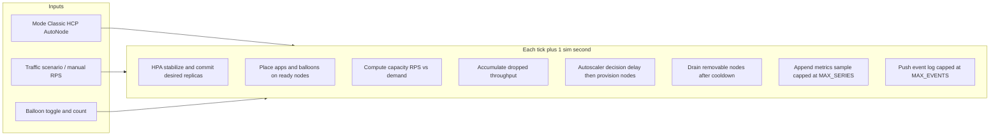

# ROSA Autoscaling Simulator

Browser-based **discrete-event style** toy model of demand, HPA, worker capacity, and cluster autoscaling. It is meant for **teaching and narrative alignment** with this repository’s ROSA Classic vs HCP vs HCP + AutoNode benchmarks — not for capacity planning or production SLO modeling.

## Usage

### Hosted copy (GitHub Pages)

After enabling **GitHub Actions** as the Pages source (see root **`README.md` → *GitHub Pages*), the same simulator is published under **`/simulator/`** on the project site (`https://<owner>.github.io/<repository>/simulator/`).

### Run locally

1. Open **`index.html`** in a modern desktop browser (Chrome, Firefox, Safari, Edge).
2. Allow **network access** on first load: the page pulls **React 18**, **ReactDOM**, **PropTypes**, **Recharts**, **Babel standalone**, and `@babel/preset-react` from public CDNs and compiles JSX in the browser.
3. Use **Play / Pause**, **Reset**, and the **mode tabs** (Classic · HCP · HCP + AutoNode).
4. Adjust **sim speed** (1×–40×): wall-clock interval between ticks is `max(25 ms, round(1000 / speed))`, and each tick advances **one simulated second** (`TICK_SIM_SEC = 1`).

```bash
# From repo root — macOS
open simulator/index.html

# Generic file URL (adjust path)
xdg-open simulator/index.html   # many Linux distros
```

### Offline / air-gapped

There is **no bundled build step**. To run without CDNs you would need to vendor the same libraries locally and change the `<script src="…">` tags in `index.html`, or replace the inline JSX with a small bundled artifact (out of scope for this folder today).

### Controls (UI)

| Control | Effect |
|--------|--------|
| Mode tabs | Switches **CAS Classic**, **CAS HCP**, or **HCP + AutoNode** parameter sets and scheduling strategy (see below). Resets scenario anchor semantics where applicable. |
| Sim speed | Faster wall-clock playback; does not change the discrete model, only how quickly ticks fire. |
| Traffic scenario | **Manual** (slider), **24h day cycle**, **On-sale burst**, **Viral surge**. Non-manual curves drive `reqsPerSec` while playing. |
| Preset peak traffic | Scales the **shape** of presets (normalized bumps × peak req/s). Range up to 4000 req/s (slider cap). |
| Day length | Only **daily**: maps one synthetic “day” (24 hours of shape) onto this many **simulated seconds** (default 1800 s). |
| Manual traffic slider | Active when scenario is **manual** and **sim time is 0**: rebuilding baseline fleet from `ceil((replicas + balloons) / slotsPerNode)` with minimum node floor. |
| Balloon pods | Optional low-priority placeholders occupying slots until apps need them (qualitative overprovisioning). |
| Cents per dropped session | Converts **unserved req/s** per tick into a **separate** illustrative USD track (not infra billing). |

**Important:** Several controls only recompute the initial fleet when **`simTime === 0`** (see **Fleet sizing at sim time 0** and reducer actions like `SET_BALLOON_*` / `SET_REQS` in `index.html`). After time advances, toggling balloons or manual traffic does not reshuffle the universe unless you **Reset** or use scenarios that update live demand without requiring those sliders at t=0.

---

## Architecture

### Delivery shape

- **Single artifact:** `index.html` contains HTML, CSS, and a large `<script type="text/babel">` block with the full React application.
- **No server:** static file; no API, no WebSocket, no persistence.
- **Rendering:** React function components + `useReducer` for deterministic game-loop state; **Recharts** for time series.

### High-level data flow



### Core state (`useReducer`)

State includes:

- **`simTime`** — monotonic simulated seconds.
- **`modeKey`** — indexes `MODES` (classic | hcp | autonode).
- **`nodes`** — array of workers with `state`: `ready` | `provisioning` | `draining`, slot arrays, provision/drain timestamps.
- **HPA fields** — `hpaStabilizingIdeal`, `hpaCommitAt`, `committedDesiredPods` (committed count used for scheduling and capacity).
- **Scaling** — `scaleUpPhase`, `scaleUpDecisionAt`, `nextNodeId`, `drainJobs`.
- **Metrics** — cumulative dropped req, running sums for USD displays.
- **`timeseries`** — last **180** samples (`MAX_SERIES`) for charts.
- **`events`** — last **80** rows (`MAX_EVENTS`) for the log.

Reducer action types (conceptually): set mode, sim speed, scenario, scenario peak, day period, manual reqs, balloon enabled/count, cents per drop, play toggle, reset, and **`TICK`** (the main physics step).

### Tick order (each simulated second)

Implementation order in the `TICK` branch matters for causality:

1. **Advance provisioning:** nodes move `provisioning → ready` when `provisionDuration` elapses.
2. **HPA:** compare **ideal replicas** from current demand to stabilizing target; start **HPA_STABILIZE_SEC** window; when elapsed, commit **`committedDesiredPods`**.
3. **Placement:** run **`placeWorkload`** on **clone** of nodes for **committed** app count and balloon count; derive pending apps/balloons and **running** app count for capacity.
4. **AutoNode consolidation hint:** if bin-pack mode and HPA scaled **down**, periodically log that tail nodes have **no app pods** (balloons allowed) and can be reclaimed after cooldown.
5. **Capacity vs demand:** each running app slot contributes **`POD_CAPACITY_RPS`**; excess demand becomes **`droppedThisSec`** and feeds session-cost assumption.
6. **Node-hour cost:** increment USD using **`M5XLARGE_USD_PER_HOUR / 3600`** × count of nodes in `ready`, `provisioning`, or `draining`.
7. **Scale-up:** if pending slots and no provisioning storm, enter **deciding** for **`decisionDelay`** sim seconds, then add **`ceil(pendingSlots / SLOTS_PER_NODE)`** new **`provisioning`** nodes (minimum 1 batch).
8. **Scale-down:** compute **`minNodesNeeded`** from committed apps + balloons; identify **ready** nodes with **no app pods** (only balloons/empty); start **drain** for excess nodes up to removable set; after **`scaleDownDuration`**, remove nodes.

There is **no** simulated kube-scheduler preemption, **no** PDBs, **no** multi-AZ, **no** real CPU/memory — only slot counting.

---

## Model constants (implementation)

These are fixed in `index.html` unless you edit the source.

| Constant | Value | Role |
|----------|-------|------|
| `MIN_NODES` | 3 | Minimum worker count (floor). |
| `MIN_APP_REPLICAS` | 2 | Floor on desired app replicas from HPA math. |
| `SLOTS_PER_NODE` | 4 | Bin-packing granularity per worker. |
| `POD_CAPACITY_RPS` | 100 | Max served req/s per **running** app slot per tick. |
| `HPA_TARGET_RPS` | 70 | Drives `idealReplicas = max(MIN_APP_REPLICAS, ceil(demand / HPA_TARGET_RPS))`. |
| `HPA_STABILIZE_SEC` | 4 | Stabilization before committing desired replicas. |
| `TICK_SIM_SEC` | 1 | One reducer tick equals one simulated second. |
| `M5XLARGE_USD_PER_HOUR` | 0.192 | Worker cost track (illustrative on-demand rate). |
| `TRAFFIC_SLIDER_MAX` | 4000 | Hard cap on req/s inputs. |
| `MAX_SERIES` | 180 | Rolling chart history length. |
| `MAX_EVENTS` | 80 | Rolling event log length. |

### Mode parameters (simulated seconds)

| Mode | Label | `decisionDelay` | `provisionDuration` | `scaleDownDuration` | Scheduling |
|------|--------|-----------------|---------------------|---------------------|------------|
| `classic` | ROSA Classic (CAS) | 34 | 398 (~6.6 min) | 596 (~9.9 min) | **spread** |
| `hcp` | ROSA HCP (CAS) | 20 | 317 (~5.3 min) | 596 (~9.9 min) | **spread** |
| `autonode` | ROSA HCP + AutoNode | 8 | 270 (~4.5 min) | 114 (~1.9 min) | **bin-pack** |

**Spread vs pack:** Classic/HCP fill replicas across nodes in a **wave** pattern (spread-first). AutoNode uses **bin-pack** (fill nodes in order). That changes how quickly some nodes become **app-empty** after scale-down and therefore how aggressively scale-in can fire in this toy model.

### Fleet sizing at sim time 0

Initial node count:

```text
max(MIN_NODES, ceil((desiredAppReplicas + balloonReplicas) / SLOTS_PER_NODE))
```

All nodes start **ready**; workload is placed immediately.

### Traffic presets (shape times in sim seconds)

Defaults embedded in code:

| Scenario | Behavior |
|----------|----------|
| **daily** | Synthetic 24 h compressed into `dayPeriodSimSec` (default 1800 s). Gaussian-ish bumps (morning, lunch, evening, late); quieter overnight window. |
| **onsale** | After anchor + **120 s** delay: **60 s** smooth ramp to peak, **360 s** plateau, **480 s** linear decay to baseline. Baseline derived from peak (`~6%` floor logic via `scenarioBaselineReqs`). |
| **viral** | Logistic ramp (**220 s**), plateau (**500 s**), quadratic decay (**720 s**). |

Selecting a non-manual scenario sets **`scenarioAnchorSim`** to current **`simTime`** when switching (so “when does the spike hit” is anchored at user intent).

---

## Metrics and charts

### Demand vs capacity

- **Demand** — live req/s from scenario or manual snapshot rules.
- **Capacity** — `runningApps * POD_CAPACITY_RPS` after placement.
- **Unserved (drops)** — `max(0, demand - capacity)` per tick; cumulative sum drives the session-impact USD track.

### Two USD tracks (do not add)

The UI states this explicitly: **worker / infra** cost (node-hours at m5.xlarge) and **modeled session impact** (dropped req × cents slider) are **comparable in scale only**. They are not additive components of a real invoice.

---

## Relationship to this repository

- **Timings and roles** are tuned to match the **storyline** of measured benchmarks (CAS vs AutoNode, faster reclaim on AutoNode, spread vs denser packing intuition).
- **Live truth** remains in **`scripts/run-test-*.py`**, **`manifests/`**, and **`benchmark-*`** skills under **`.cursor/skills/`**.

---

## Limitations (read before trusting any number)

- Not calibrated to your workloads, regions, instance families, or ROSA control-plane latency.
- No network, no etcd, no API server saturation, no noisy neighbor — only arithmetic.
- No partial CPU, no horizontal fragmentation of a single pod, no DaemonSets, no quotas.
- Balloons are **slot placeholders**, not a faithful PriorityClass / preemption simulation.
- Charts cap history; long runs drop early points from the series buffer.

---

## Hacking and maintenance

- **Change physics:** edit constants and the `TICK` branch in **`index.html`** (search for `function reducer` and `MODES`).
- **Change UI:** same file — React components `App`, `AreaChartSync`, and inline CSS `:root` tokens.
- **Version pins:** CDN URLs are unpinned beyond what unpkg/jsdelivr serve; for reproducible demos, pin exact versions or vendor assets.

For repository-wide context, see the root **`README.md`** section **Browser autoscaling simulator**.
